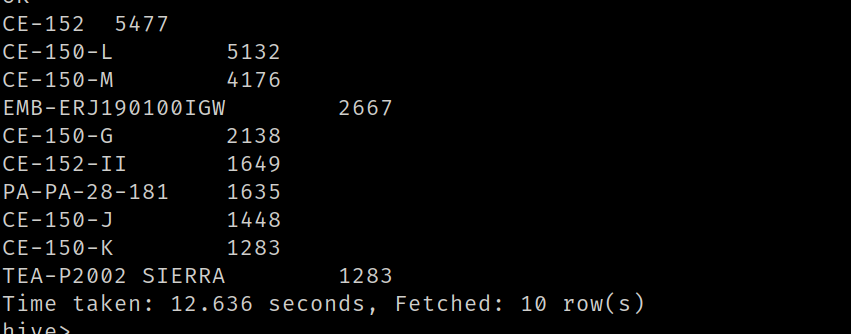

10.​Cuales son las 10 aeronaves más utilizadas entre el 01/01/2021 y el 30/06/22 que
despegaron desde la Ciudad autónoma de Buenos Aires o de Buenos Aires,
exceptuando aquellas aeronaves que no cuentan con nombre. Mostrar consulta y
Visualización

SELECT
    v.aeronave,
    COUNT(*) AS cantidad_despegues
FROM vuelos v
JOIN aeropuertos_detalle ad ON v.aeropuerto = ad.`local`
WHERE
    v.tipo_de_movimiento = 'Despegue'
    AND (ad.provincia = 'BUENOS AIRES' OR ad.provincia = 'CIUDAD AUTÓNOMA DE BUENOS AIRES')
    AND v.aeronave IS NOT NULL AND v.aeronave != '0' AND v.aeronave != ''
    AND v.fecha >= '2021-01-01' AND fecha <= '2022-06-30'
GROUP BY v.aeronave
ORDER BY cantidad_despegues DESC
LIMIT 10;

