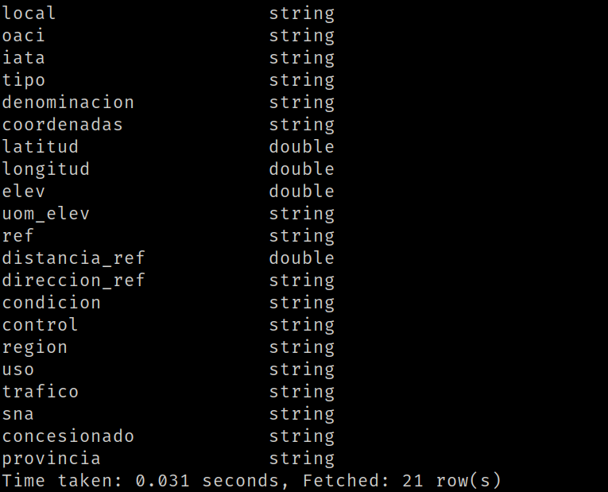
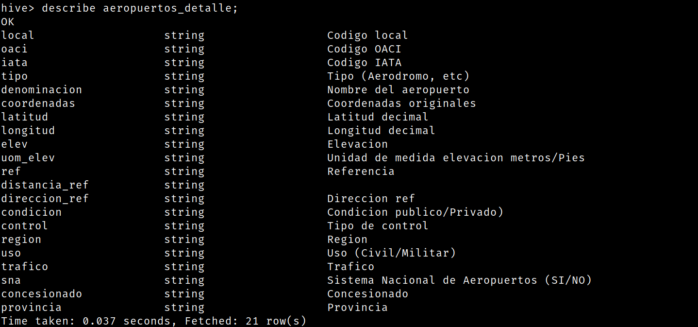

Mostrar mediante una impresión de pantalla, que los tipos de campos de las tablas
sean los solicitados en el datawarehouse (ej: fecha date, aeronave string, pasajeros
integer, etc.)

hive> DESCRIBE vuelos;

hive> DESCRIBE aeropuertos_detalle;

