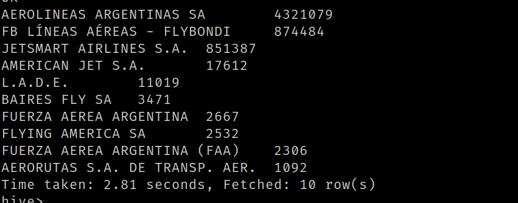

9.​ Cuales son las 10 aerolíneas que más pasajeros llevaron entre el 01/01/2021 y el
30/06/2022 exceptuando aquellas aerolíneas que no tengan nombre. Mostrar consulta y
Visualización

SELECT
    aerolinea_nombre,
    SUM(pasajeros) AS total_pasajeros
FROM vuelos
WHERE aerolinea_nombre IS NOT NULL AND aerolinea_nombre != '0' AND aerolinea_nombre != ''
  AND fecha >= '2021-01-01' AND fecha <= '2022-06-30'
GROUP BY aerolinea_nombre
ORDER BY total_pasajeros DESC
LIMIT 10;

